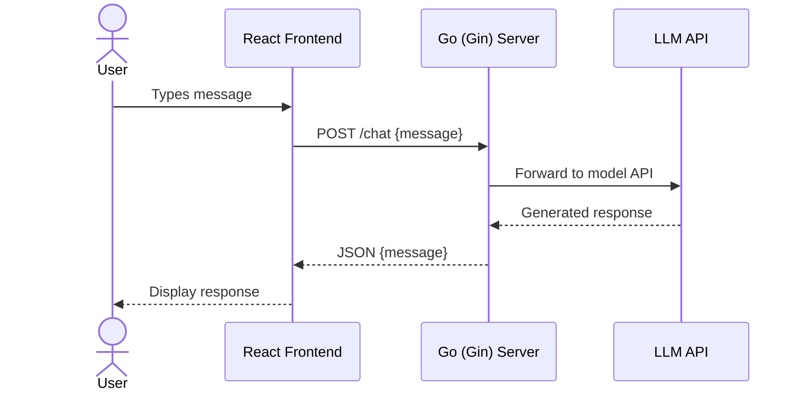

# Ultrafast LLM Chatbot

**Low-latency chatbot with a Go (Gin) backend and React frontend.**

A lightweight, high-performance ChatGPT-style interface designed for fast inference. The Go backend handles API requests with minimal overhead, while the React frontend provides a clean conversational UI.

---

## Architecture

```mermaid
graph LR
    subgraph Frontend["React Frontend (:3000)"]
        UI[Chat Interface]
    end

    subgraph Backend["Go Backend (:8080)"]
        GIN[Gin Router]
        CHAT[/chat handler]
        STATIC[Static File Server]
    end

    subgraph External
        LLM[OpenAI API / LLM Provider]
    end

    UI -->|POST /chat| GIN
    GIN --> CHAT
    CHAT -->|API call| LLM
    LLM -->|response| CHAT
    CHAT -->|JSON| UI
    GIN --> STATIC
    STATIC -->|React build| UI

    style Frontend fill:#1e293b,stroke:#38bdf8,color:#e2e8f0
    style Backend fill:#1e293b,stroke:#34d399,color:#e2e8f0
    style External fill:#0f172a,stroke:#a78bfa,color:#e2e8f0
```

### Request Flow



---

## Features

- **Low latency** — Go + Gin framework for fast request handling with minimal overhead
- **LLM-powered responses** — Pluggable LLM backend (OpenAI, local models, LangChain agents)
- **Optimized frontend** — Clean React interface, responsive and lightweight
- **Single-binary deployment** — Go serves both the API and the React build output
- **Extensible** — designed for integration with LangChain agents and Python modules for custom workflows

---

## Quick Start

### Prerequisites

- [Go](https://go.dev/dl/) 1.21+
- [Node.js](https://nodejs.org/) 18+

### Backend

```bash
git clone https://github.com/Akasxh/ultrafast-llm-chatbot.git
cd ultrafast-llm-chatbot

# Install Go dependencies
go mod download

# Run the server
go run main.go
# Server runs on http://localhost:8080
```

### Frontend

```bash
cd frontend

# Install dependencies
npm install

# Development mode
npm start

# Production build (served by Go backend)
npm run build
```

After building, the Go server serves the React app at `http://localhost:8080`.

---

## Project Structure

```
ultrafast-llm-chatbot/
├── main.go                    # Gin server: /chat endpoint + static file serving
├── go.mod
├── go.sum
└── frontend/
    ├── src/
    │   ├── App.js             # Chat UI component
    │   ├── App.css
    │   ├── index.js
    │   └── index.css
    ├── public/
    │   ├── index.html
    │   └── manifest.json
    └── package.json
```

---

## Tech Stack

| Component | Technology |
|-----------|-----------|
| Backend | Go, Gin framework |
| Frontend | React, JavaScript |
| LLM | OpenAI API (pluggable) |
| Deployment | Single Go binary serving both API and static files |

---

## API

### POST /chat

Send a message and receive an LLM-generated response.

**Request:**
```json
{
  "message": "Hello, how are you?"
}
```

**Response:**
```json
{
  "message": "Hello from backend!"
}
```

---

## Contributing

1. Fork the repository
2. Create a feature branch: `git checkout -b feature/my-feature`
3. Commit with conventional commits
4. Open a pull request against `main`

---

## License

MIT
